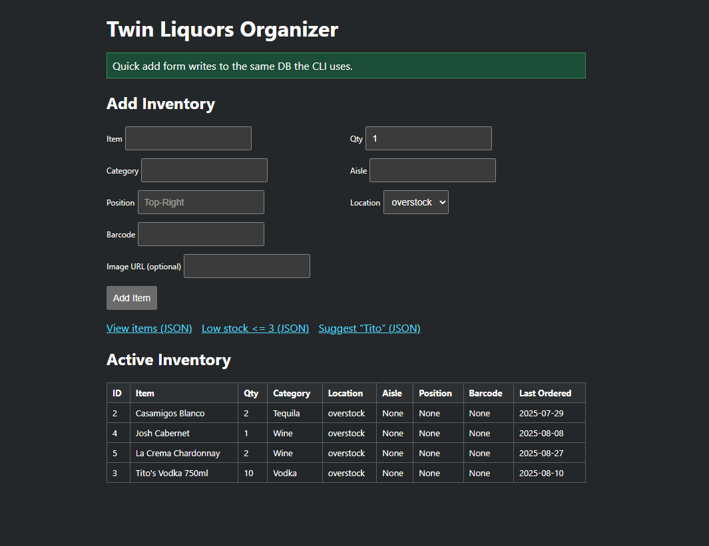

# Twin Liquors Organizer 🍾

A **Python + FastAPI + Docker** app to help organize liquor store inventory.
It supports both a **CLI tool** and a **web interface** that share the same MariaDB database.

---

## Features
- 📦 **Inventory Management**
  - Add, update, archive items
  - Track category, aisle, shelf/overstock, barcode, image URL
- 🔍 **Low Stock Reports**
  - CLI and CSV export
- ✅ **Duties Tracker**
  - Add & complete daily store duties
- 🌐 **FastAPI Web App**
  - Simple form to add items
  - API endpoints for JSON access
- 🐳 **Dockerized Database**
  - MariaDB container with schema + seed data
- 🔒 **Code Quality & DevOps**
  - Pre-commit hooks (Black, Ruff, isort-style imports, trailing whitespace fixes)
  - GitHub Actions CI pipeline (linting + formatting)

---

## Tech Stack
- **Python 3.12**
- **FastAPI** (API + HTML templates)
- **Uvicorn** (ASGI server)
- **MariaDB** (via Docker Compose)
- **PyMySQL** (DB driver)
- **Tabulate** (pretty CLI tables)
- **Pre-commit + GitHub Actions** (code quality CI)

---

## Screenshots

Example:
```markdown
Here’s a preview of the FastAPI web app:

```

---

## Getting Started

### 1. Clone this repo
```bash
git clone https://github.com/<your-username>/twinliquors-organizer.git
cd twinliquors-organizer
```

### 2. Start MariaDB with Docker
```bash
docker compose up -d
```

### 3. Set up Python environment
```bash
python -m venv .venv
.\.venv\Scripts\activate  # Windows
pip install -r app/requirements.txt
```

### 4. Run CLI
```bash
python app/main.py list-items
```

### 5. Run FastAPI server
```bash
uvicorn app.server:app --reload
```
Then open 👉 http://127.0.0.1:8000

---

## Example Commands
- List items:
  ```bash
  python app/main.py list-items
  ```
- Add an item:
  ```bash
  python app/main.py add-item --item "Josh Cabernet" --qty 5 --cat "Wine" --aisle "A1" --loc "shelf"
  ```
- Export low stock:
  ```bash
  python app/main.py export-low-stock --threshold 3 --csv reports/low_stock.csv
  ```

---

## Project Status
🚧 Work in Progress —
- ✅ CLI + basic FastAPI UI working
- ✅ Database schema + Docker setup
- ✅ Pre-commit hooks + GitHub Actions CI
- 🔜 Next steps: render inventory in web UI, add barcode support, host online demo

---
